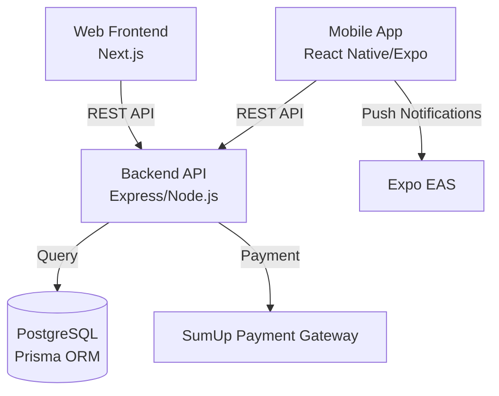

# 🍔 Smash'd - Multi-Platform Food Ordering System

A comprehensive food ordering platform featuring a Next.js web frontend, React Native mobile app (Expo), and a robust Node.js backend with SumUp payment integration.

## 🏗️ System Architecture



## 📱 Platform Overview

- **Backend**: Node.js, Express, TypeScript, Prisma, PostgreSQL
- **Frontend**: Next.js (App Router), TypeScript, Tailwind CSS, Radix UI
- **Mobile**: React Native, Expo (Router & Secure Store), NativeWind
- **Payments**: SumUp (Hosted Checkout for Web, Native SDK for Mobile)

---

## 🚀 Development Environment Setup

### Prerequisites

Ensure you have the following installed before starting:

- **Node.js**: >= 18.0.0 (Recommended: LTS)
- **npm**: >= 9.0.0
- **Git**: Latest version
- **Docker**: For running the local PostgreSQL database
- **Process Manager**: `npm install -g foreman` (recommended) or `overmind`
- **Expo CLI**: `npm install -g expo-cli` (For mobile development)

### Quick Start (Unified Workflow)

Since this is a monorepo, you can run the entire stack (Database, Backend, Frontend, Mobile) with a single command.

#### 1. Install Dependencies
Run this in the root directory to install dependencies for all subsystems:

```bash
# Backend
cd backend && npm install && cp .env.example .env && cd ..

# Frontend
cd frontend && npm install && cp .env.example .env.local && cd ..

# Mobile App
cd app && npm install && cp .env.example .env && cd ..
```

> [!NOTE]
> Ensure you update the `.env` files with your specific configuration if defaults don't match your system.

#### 2. Start All Services

**Option A: VS Code (Recommended - Scrollable Tabs)**
If you are using VS Code, I have set up integrated tasks:
1.  Press **`Cmd + Shift + P`** (Mac).
2.  Type **"Run Task"** and select it.
3.  Choose **"🚀 Start All Services"**.

This will open **four separate, scrollable terminal tabs** inside VS Code (one for each service).

**Option B: Terminal (CLI)**
Use `foreman` (or `overmind`) to start all processes defined in the `Procfile`:

```bash
foreman start
```

This will concurrently launch:
- **db**: PostgreSQL via Docker (Port 5432)
- **backend**: Express API (Port 5001)
- **frontend**: Next.js Admin Panel (Port 3000)
- **mobile**: Expo Go Server (Port 8081)

> [!TIP]
> Ports are explicitly set in the `Procfile` to prevent process managers like **Overmind** from auto-assigning them to different values.

---

## 🏃‍♂️ Running Independently & Mobile Config

### Individual Services
If you prefer running services manually:
1.  **Terminal 1 (DB & Backend)**: `docker compose up -d && cd backend && npm run dev`
2.  **Terminal 2 (Web)**: `cd frontend && npm run dev`
3.  **Terminal 3 (Mobile)**: `cd app && npx expo start`

### Testing with Physical Devices
To test the mobile app on a real phone (not simulator), `localhost` won't work.
1.  Find your computer's local IP address (e.g., `192.168.1.50`).
2.  Update `backend/.env` `ALLOWED_ORIGINS` to include this IP.
3.  Update `app/.env` `EXPO_PUBLIC_API_URL` to `http://192.168.1.50:5001/v1`.
4.  Restart `foreman` or the specific servers.

### Testing with Mobile Devices
If testing the mobile app on a physical device, `localhost` will not work.
1.  Find your computer's local IP address (e.g., `192.168.1.50`).
2.  Update `.env` in `backend` to allow this origin if CORS is strict.
3.  Update `EXPO_PUBLIC_API_URL` in `app/.env` to `http://192.168.1.50:5001/v1`.
4.  Restart both servers.

---

## 🛠 Best Practices & Workflow

### Git Workflow
- **Main Branch**: `main` is the production-ready branch. Do not push directly.
- **Feature Branches**: Create branches for all changes: `feature/my-new-feature` or `fix/payment-bug`.
- **Pull Requests**: All changes require a PR review before merging.

### Code Style
- **TypeScript**: Strict mode is enabled. Avoid `any` types.
- **Linting**: Run `npm run lint` (in respective folders) before committing.
- **Formatting**: We use Prettier. Ensure your editor is configured to format on save.

### Testing Strategy
- **Backend**:
    - Unit Tests: `npm run test:unit`
    - Integration Tests: `npm run test:integration` (Requires running DB)
- **Frontend/Mobile**:
    - Jest is configured for component testing.
    - `npm test` runs the test suite.

---

## 🌍 Production Setup & Deployment

### Backend (Railway / VPS)
1.  **Build**: `npm run build` (Compiles TS to JS in `dist/`).
2.  **Environment**: ensure `NODE_ENV=production`. Set strict `ALLOWED_ORIGINS`.
3.  **Database**: Use a managed PostgreSQL provider (e.g., Railway, Neon, AWS RDS). Apply migrations via `npx prisma migrate deploy`.

### Frontend (Vercel)
1.  Connect your repository to Vercel.
2.  Set Root Directory to `frontend`.
3.  Add Environment Variables (`NEXT_PUBLIC_...`).
4.  Vercel automatically detects Next.js and builds using `npm run build`.

### Mobile (Expo EAS)
1.  Install EAS CLI: `npm install -g eas-cli`.
2.  Login: `eas login`.
3.  Configure Build: Update `eas.json` for build profiles (dev/preview/production).
4.  **Build for Stores**:
    ```bash
    cd app
    eas build --platform ios
    eas build --platform android
    ```
5.  **OTA Updates**: Use `eas update` to push non-native changes instantly.

---

## ❓ Troubleshooting

**Q: Backend cannot connect to Database?**
A: Check if Docker is running (`docker ps`). Ensure the `DATABASE_URL` matches the exposed port (default 5432).

**Q: CORS Errors on Frontend?**
A: Add your frontend URL (e.g., `http://localhost:3000`) to `ALLOWED_ORIGINS` in `backend/.env`.

**Q: "Network Error" on Android Emulator?**
A: Android emulators see host `localhost` as `10.0.2.2`. Use that IP or your machine's LAN IP.
