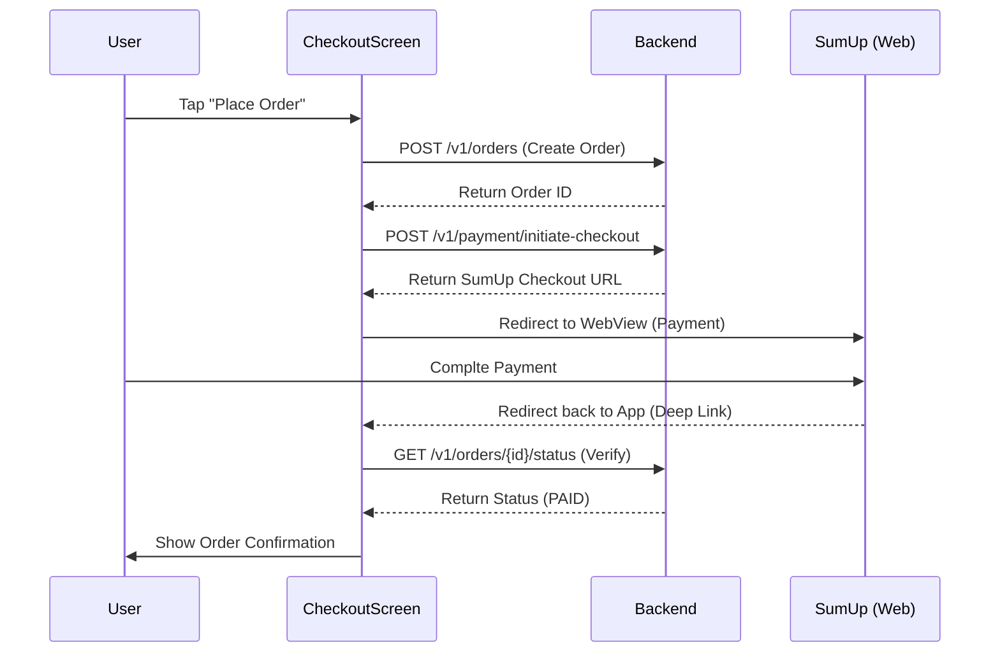
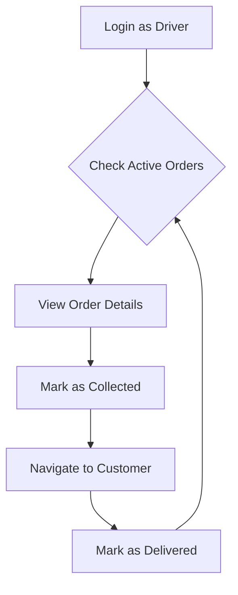

# Smashd Mobile App 📱

The customer and driver application for the Smashd platform, built with React Native and Expo. Seamlessly handles menu browsing, order customization, secure payments via SumUp, and real-time delivery tracking.

## 1. Overview
Smashd is a high-performance mobile application providing a premium ordering experience. It serves two primary user roles:
- **Customers**: Browse the menu, customize items (toppings, sauces, extras), place orders, and track delivery.
- **Drivers**: Manage active deliveries, view order details, and update fulfillment status.

### Tech Stack
- **Framework**: [Expo](https://expo.dev) / [React Native](https://reactnative.dev)
- **Navigation**: [Expo Router](https://docs.expo.dev/router/introduction/) (File-based routing)
- **Styling**: [NativeWind](https://www.nativewind.dev/) (Tailwind CSS for React Native)
- **State Management**: React Context API (Auth, Cart, Theme)
- **Components**: [RNR Primitives](https://github.com/roninoss/rnr-primitives) (Tailwind-styled Radix primitives for RN)
- **Icons**: Lucide React Native
- **Networking**: Axios with centralized interceptors
- **Payments**: SumUp Integration via WebView

---

## 2. Architecture / Folder Structure

```text
app/
├── (auth)/             # Authentication routes (Login, Register, Password Reset)
├── (tabs)/             # Main application tabs (Menu, Cart, Profile, Driver)
├── +not-found.tsx      # 404 handler
├── _layout.tsx         # Root layout with providers (Auth, Cart, Theme)
├── checkout.tsx        # Order summary and checkout initiation
├── payment-webview.tsx # Secure payment processing interface
services/               # API clients and business logic
├── api.ts              # Central axios instance and API endpoints
├── sumupService.ts     # SumUp specific logic
├── notificationService.ts # Expo Push Notifications
contexts/               # Global state providers
hooks/                  # Shared custom hooks
components/             # Reusable UI components
├── ui/                 # Atomic UI elements (Buttons, Inputs, Cards)
constants/              # App constants and theme colors
```

---

## 3. Flows

### Order Placement & Payment Flow
This flow handles the transition from cart to a confirmed order.



### Driver Workflow


---

## 4. Setup / Installation

### Prerequisites
- Node.js (v18+)
- Expo Go app on your physical device or an Android/iOS emulator

### Steps
1. **Install Dependencies**
   ```bash
   npm install
   ```
2. **Environment Variables**
   Create a `.env` file (or use `APP_VARIANT` with `app.config.js`):
   ```env
   EXPO_PUBLIC_API_URL=http://your-backend-ip:3000
   ```
3. **Start Development Server**
   ```bash
   npm run start
   ```

---

## 5. Key Features

- **Guest Mode**: Allows users to browse the menu without an account.
- **Dynamic Customization**: Items can have category-based options (Extras, Sauces, Toppings) with real-time price calculation.
- **Real-time Order Status**: Polling and notification hooks keep the user updated on their food's progress.
- **Driver Dashboard**: Exclusive interface for delivery staff to manage their queue.

---

## 6. API / Services

All API calls are abstracted in `services/api.ts`.
- **`authAPI`**: Login, Register, Password management.
- **`menuAPI`**: Fetching categorized menu items and individual customizations.
- **`orderAPI`**: Creation, status polling, and payment verification.
- **`driverAPI`**: Specialized endpoints for delivery management.

---

## 7. Important Patterns / Conventions

- **Context over Redux**: We use specific contexts (`AuthContext`, `CartContext`) for scoped global state.
- **Lucide Icons**: Use `lucide-react-native` for all iconography to maintain consistency.
- **NativeWind**: Use standard Tailwind class names in the `className` prop.
- **Safe Area Management**: Always wrap screen content in `SafeAreaView` from `react-native-safe-area-context`.
- **API Error Handling**: The axios interceptor in `api.ts` handles 401s and token persistence globally.

---

## 8. Deployment / Dev Workflow

### Build Variants
The project uses `expo-constants` and `app.config.js` to manage environments:
- `npm run ios`: Starts dev build for iOS.
- `npm run android:prod`: Starts production-pointing build for Android.

### CI/CD
We use **EAS (Expo Application Services)** for cloud builds and submissions.
- `eas build --platform ios`: Trigger an iOS build.
- `eas build --platform android --profile production`: Trigger a production Android build.

---

## 9. Troubleshooting / Gotchas

- **Local API Access**: If testing on a physical device, ensure `EXPO_PUBLIC_API_URL` uses your machine's LAN IP, not `localhost`.
- **Native Modules**: This project uses several native modules. If adding new ones, you MUST run a prebuild (`expo run:ios/android`) rather than just using Expo Go.
- **WebView Caching**: SumUp redirects can sometimes cache. Ensure checkout IDs are unique per attempt.

---

## 10. References
- [Backend Documentation](../backend/README.md)
- [Admin Panel](../frontend/README.md)
- [SumUp API Docs](https://developer.sumup.com/rest-api)
