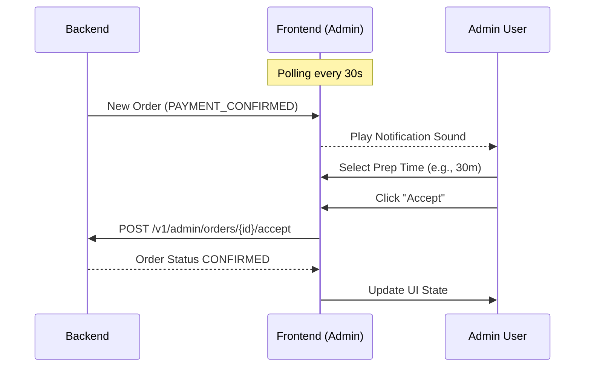
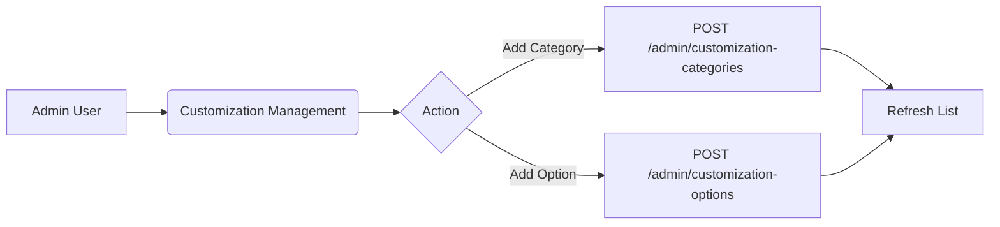

# Smashd Admin & Management Panel 🛠️

The central administrative hub for the Smashd platform, built with Next.js 14. This subsystem provides store owners with the tools to manage menus, track orders in real-time, analyze performance, and configure store settings.

## 1. Overview
The frontend is a modern web application designed for desktop use by platform administrators and restaurant staff. It interfaces directly with the Smashd Backend to provide a seamless management experience.

### Tech Stack
- **Framework**: [Next.js 14](https://nextjs.org/) (App Router)
- **Language**: TypeScript
- **Styling**: [Tailwind CSS](https://tailwindcss.com/) + [Framer Motion](https://www.framer.com/motion/) (Animations)
- **UI Components**: [Radix UI](https://www.radix-ui.com/) (Primitives) + [Lucide](https://lucide.dev/) (Icons)
- **State Management**: React State & Context
- **Data Fetching**: Centralized `fetch` wrapper with Auth interceptors
- **Analytics**: Recharts for data visualization

---

## 2. Architecture / Folder Structure

```text
frontend/
├── app/                # Next.js App Router
│   ├── admin/          # Protected Administrative routes
│   │   ├── analytics/  # Sales and performance data
│   │   ├── page.tsx    # Admin Dashboard main entry
│   │   └── ...         # Management modules (Stock, Customization, etc.)
│   ├── login/          # Administrative login
│   ├── layout.tsx      # Root layout with animate-presence and providers
│   └── page.tsx        # Customer-facing landing page (Beta/Preview)
├── components/         # Reusable React components
│   └── ui/             # Atomic design components (Shadcn/Radix)
├── lib/                # Shared utilities and API clients
│   ├── api.ts          # Central API client with automatic 401 handling
│   └── apiConstants.ts # Backend endpoint configuration
├── hooks/              # Shared custom hooks
└── public/             # Static assets (images, sounds, icons)
```

---

## 3. Flows

### Order Management Workflow
Administrators monitor incoming orders and manage the fulfillment lifecycle.



### Menu & Customization Flow
Updating the store's offerings in real-time.



---

## 4. Setup / Installation

### Prerequisites
- Node.js (v18+)

### Steps
1. **Install Dependencies**
   ```bash
   npm install
   ```
2. **Environment Variables**
   Create a `.env` file based on `.env.example`:
   ```env
   NEXT_PUBLIC_API_URL=http://localhost:3100/v1
   ```
3. **Start Development Server**
   ```bash
   npm run dev
   ```

---

## 5. Key Features

- **Real-time Order Alerts**: Audio-visual notifications for new incoming orders.
- **Dynamic Menu Management**: Create and edit menu items with Cloudinary image integration and complex customization categories.
- **Advanced Analytics**: Visual dashboards for tracking daily sales, popular items, and customer trends.
- **Stock Control**: Quick toggles to mark items as "Out of Stock" to sync across all platforms immediately.

---

## 6. API / Services

The frontend uses a centralized API client located in `lib/api.ts`.
- **Automatic Auth**: Attaches `Bearer` tokens from `localStorage` to all requests.
- **Session Management**: Automatically redirects to `/login` if a `401 Unauthorized` response is received.
- **Payload Handling**: Wraps generic `fetch` with convenience methods (`api.get`, `api.post`, etc.).

---

## 7. Important Patterns / Conventions

- **`AdminAuthWrapper`**: Every administrative page is wrapped in this component to ensure only users with the `ADMIN` role can access the route.
- **Client-Side Persistence**: Auth tokens and user profiles are persisted in `localStorage`.
- **Framer Motion Transitions**: Use `AnimatePresence` in `layout.tsx` for smooth page transitions.
- **UI Consistency**: Use Radix-based primitives located in `components/ui/` to maintain the design system.

---

## 8. Development Workflow

- **Local Dev**: Use `npm run dev` for hot-reloading.
- **Production Build**: 
  ```bash
  npm run build
  npm run start
  ```
- **Linting**: Run `npm run lint` before committing to ensure standard adherence.

---

## 9. Troubleshooting / Gotchas

- **Hydration Errors**: Ensure `localStorage` access is guarded with `typeof window !== 'undefined'`.
- **API URL**: If backend is running on a different port or machine, ensure `NEXT_PUBLIC_API_URL` is updated.
- **CORS**: Ensure the backend allows requests from the frontend origin (typically `localhost:3000`).

---

## 10. References
- [Backend Documentation](../backend/README.md)
- [Customer App](../app/README.md)
- [Next.js Documentation](https://nextjs.org/docs)
